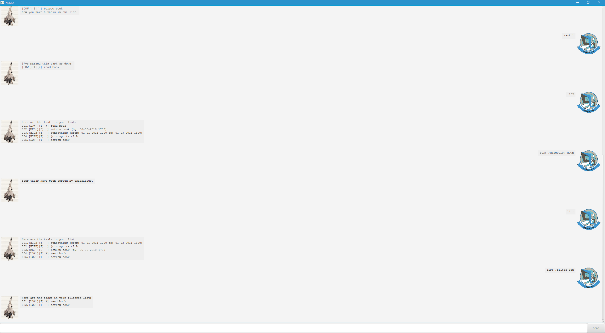

# Nemo User Guide



_(Nemo profile picture reused from Ace Combat 3: Electrosphere. Developer: Namco. Publisher: Namco)_
 _(User profile picture reused from Ace Combat 04: Shattered Skies. Developer: Namco. Publisher: Namco)_

&nbsp;
&nbsp;

Nemo is a desktop program used for managing personal tasks. It functions as an interactive chatbot with elements of the Command Line Interface (CLI) presented with a Graphical User Interface (GUI).

## Save File

_Save File section below adapted from [AB3 User Guide](https://se-education.org/addressbook-level3/UserGuide.html#features) by National University of Singapore Cs2103/T teaching team._

### Location

* The save file is located at `C:\Users\{user}\NEMO\data.txt` on Windows and `~/NEMO/data.txt` on Linux.
* If this save file is not found, or could not be opened for whatever reason, NEMO will warn the user with a red notification message on the top of the screen.  

### Saving 

* The data is saved to the save file as soon as the user exits NEMO. There is no need to save manually.

### Editing Save Data

* The save file is in plain text and can be edited directly by advanced users, though great care must be taken to avoid corrupting the file.

> [!CAUTION]
> If the save file is corrupted, NEMO will not be able to parse the save data correctly, and will behave as if no tasks were ever saved. 
> If the user were to exit the program in this state, the save data would be overriden and permanently lost. 
> For this reason, users who wish to edit the save file should make a backup of it before proceeding.

## Command Format

_Command Format section below reused with minor modifications from [AB3 User Guide](https://se-education.org/addressbook-level3/UserGuide.html#features) by National University of Singapore Cs2103/T teaching team._

* Words in `UPPER_CASE` are the parameters to be supplied by the user.
* Items in square brackets are optional eg. `list [/filter PRIORITY]`.
* Parameters can be in any order.
* Extraneous parameters for commands that do not take in parameters will be ignored.

## Commands

_Command Format section below adapted from [AB3 User Guide](https://se-education.org/addressbook-level3/UserGuide.html#features) by National University of Singapore Cs2103/T teaching team._

### Add Todo Task `todo`

Add a new Todo task to the NEMO task list.

`todo [TODO_TASK] /priority [PRIORITY]`

* `TODO_TASK` String describing the Todo task to be added.
* `PRIORITY` Either `LOW`, `MED`, `HIGH` describing the priority level of the task (case-insensitive).

Example:
`todo Go to gym /priority LOW` 
Adds a Todo task with goal "Go to gym" with a `LOW` priority level.

Output:
```
I've added this task:
[LOW ][T][ ] Go to gym
Now you have 1 tasks in the list.
```

### Add Deadline Task `deadline`

Add a new Deadline task to the NEMO task list.

`todo [DEADLINE_TASK] /by [BY_DATETIME] /priority [PRIORITY]`

* `DEADLINE_TASK` String describing the Deadline task to be added.
* `BY_DATETIME` Datetime string in format `dd-MM-yyyy HHmm` format, which the task needs to be completed by.
* `PRIORITY` Either `LOW`, `MED`, `HIGH` describing the priority level of the task (case-insensitive).

Example:
`deadline Buy concert tickets /by 03-03-2026 0600 /priority MED` 
Adds a DEADLINE task with goal "Buy concert tickets", by 03-03-2026 0600, with a `MED` priority level.

Output:
```
I've added this task:
[MED ][D][ ] Buy concert tickets (by: 03-03-2026 0600)
Now you have 2 tasks in the list.
```

### Add Event Task `event`

Add a new Event task to the NEMO task list.

`todo [EVENT_TASK] /from [FROM_DATETIME] /to [TO_DATETIME] /priority [PRIORITY]`

* `EVENT_TASK` String describing the Event task to be added.
* `FROM_DATETIME` Datetime string in format `dd-MM-yyyy HHmm` format, which the task starts at. Must be strictly before `TO_DATETIME`.
* `TO_DATETIME` Datetime string in format `dd-MM-yyyy HHmm` format, which the task ends at.
* `PRIORITY` Either `LOW`, `MED`, `HIGH` describing the priority level of the task (case-insensitive).

Example:
`event Attend wedding /from 03-03-2026 1200 /to 03-03-2026 1400 /priority HIGH` 
Adds a EVENT task with goal "Attend wedding", from 03-03-2026 1200 to 03-03-2026 1400, with a `HIGH` priority level.

Output:
```
I've added this task:
[HIGH][E][ ] Attend wedding (from: 03-03-2026 1200 to: 03-03-2026 1400)
Now you have 3 tasks in the list.
```

### List Tasks `list`

List the currently loaded tasks, optionally filtered by priority.

`list [/filter PRIORITY]`

* `PRIORITY` Either `LOW`, `MED`, `HIGH` describing the priority level of the tasks to display, if filtered. If not used, all tasks will be displated.

Example:
`list` Lists all tasks available.

Output:
```
Here are the tasks in your list:
001. [LOW ][T][ ] Go to gym
002. [MED ][D][ ] Buy concert tickets (by: 03-03-2026 0600)
003. [HIGH][E][ ] Attend wedding (from: 03-03-2026 1200 to: 03-03-2026 1400)
```

Example:
`list /filter LOW` Lists all tasks available with LOW priority level.

Output:
```
Here are the tasks in your filtered list:
001. [LOW ][T][ ] Go to gym
```

### Find Tasks

Find tasks with goals that fit a search query.

`find QUERY`

* `QUERY` The string to search the tasks for. Case-sensitive.

Example:
`find Buy` Finds all tasks with goals containing the string "Buy".

Output:
```
001. [MED ][D][ ] Buy concert tickets (by: 03-03-2026 0600)
```

### Mark Tasks

Mark tasks specified by the index assigned with the `list` command. Has no effect on already marked tasks.

`mark INDEX`

* `INDEX` The index assigned to tasks with the `list` command.

Example:
`mark 1` Marks the first task that is listed with the `list` command.

Output:
```
I've marked this task as done:
[LOW ][T][X] Go to gym
```

### Unmark Tasks

Unmark tasks specified by the index assigned with the `list` command. Has no effect on already unmarked tasks.

`unmark INDEX`

* `INDEX` The index assigned to tasks with the `list` command.

Example:
`unmark 1` Unmarks the first task that is listed with the `list` command.

Output:
```
I've marked this task as not done yet:
[LOW ][T][ ] Go to gym
``` 

### Sort Tasks

Sort tasks based on their priority level, in increasing or decreasing levels of priority.

`sort /direction DIRECTION`

* `DIRECTION` is either `UP` for sorting tasks by increasing levels of priority, or `DOWN` for sorting tasks by decreasing levels of priority. 

Example:
`sort /direction DOWN` Sorts tasks by decreasing levels of priority.

Output:
```
Here are the tasks in your list:
001. [HIGH][E][ ] Attend wedding (from: 03-03-2026 1200 to: 03-03-2026 1400)
002. [MED ][D][ ] Buy concert tickets (by: 03-03-2026 0600)
003. [LOW ][T][ ] Go to gym
```

### Delete Tasks

Delete tasks specified by the index assigned with the `list` command.

`delete INDEX`

* `INDEX` The index assigned to tasks with the `list` command.

Example:
`delete 2` Deletes the second task that is listed with the `list` command.

Output:
```
I've removed this task:
[MED ][D][ ] Buy concert tickets (by: 03-03-2026 0600)
Now you have 2 tasks lin the list.
``` 

### Exit NEMO

Exit the NEMO program. NEMO will save your tasks to file and close the window after a short delay.

`bye`

Example:
`bye` Save your tasks to file and close the window after a short delay.

Output:
```
Bye.
```
